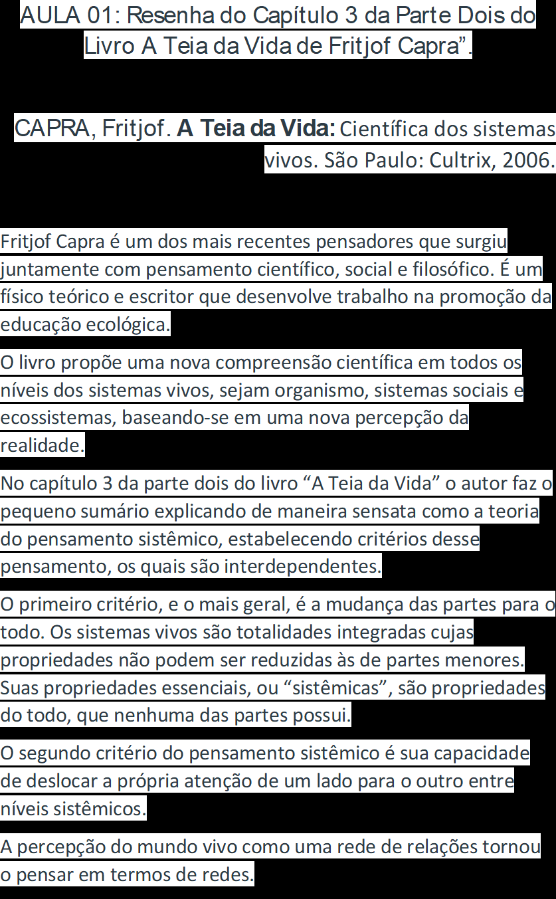

# Teoria Geral dos Sistemas

A mesma possibilitou que os sistemas de informação, classe particular de Sistemas, pudessem ser tratados como uma porção do universo,
delimitado por uma linha imaginária que circunscreve um conjunto de elementos que trocam entre si ou com o exterior: **energia, máteria ou informação**.
Esse contéudo circunscrito torna-se o Sistema referido, o qual influência e é influenciado pelo exterior (outros sistemas) por meio de interfaces que se
encontram sobre a linha imaginário (ex: locação de transporte via tela de um dispositivo, torneira, tomadas de energias, etc.)

# Características dos Sistemas

