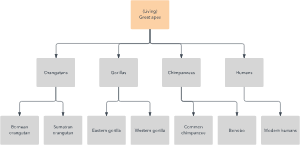
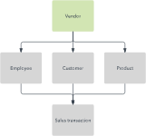
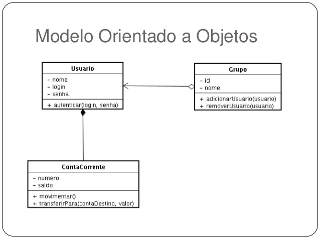
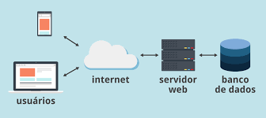

# Teoria Geral dos Sistemas

A mesma possibilitou que os sistemas de informação, classe particular de Sistemas, pudessem ser tratados como uma porção do universo,
delimitado por uma linha imaginária que circunscreve um conjunto de elementos que trocam entre si ou com o exterior: **energia, máteria ou informação**.
Esse contéudo circunscrito torna-se o Sistema referido, o qual influência e é influenciado pelo exterior (outros sistemas) por meio de interfaces que se
encontram sobre a linha imaginário (ex: locação de transporte via tela de um dispositivo, torneira, tomadas de energias, etc.)

# Tipos de Modelos de Bancos de Dados

* Modelo Relacional
* Modelo de Rede
* Modelo de banco de dados orientado para objetos
* Modelo entidade-relacionamento
* Modelo documental
* Modelo entidade-atributo-valor
* Esquema em estrela
* Modelo relacional-objeto, que combina os dois que compõem seu nome

O fator mais importante é se o sistema de gestão de banco de dados que você usa suporta um modelo específico.
Os modelos de dados **conceituais de alto nível** são os melhores para mapear as relações entre os dados de maneira que as pessoas percebam esses dados.
Os modelos **lógicos baseados em registros**, por outro lado, refletem melhor as formas com que os dados são armazenados no servidor.
Independentemente desses modelos as prioridades incluírem velocidade, redução de custo, usabilidade e agilidade.

## Modelo Relacional

O modelo mais comum, o modelo relacional, classifica dados em tabelas, também conhecidas como relações, cada uma das quais consiste em colunas e linhas.
Um determinado atributo ou combinação de atributos é escolhido como uma chave primária que pode ser consultada em outras tabelas, quando
é chamada de chave estrangeira.
Exemplo:

| Student ID | First name | Last name |
|:-----------|:-----------:|:---------|
 | 52-1000    |    Charles | Peters|
 | 48-2000   | Anthony| Sondrup|
 | 14-2000 | Rebeca | Philips|

| Provider ID | Provider name |
|:------------|:--------------|
 | 156  | UnitedHealth |
 | 146 | Blue Shield |
 | 447 | Carefirst Inc. |
         
| Student ID | ProviderID | Type of plan | Start date |
|:-----------|:-----------|:-------------|:-----------|
 | 52-1000 | 156 | HSA | 04/01/2016|
 | 48-2000 | 146 | HMO | 12/01/2015|
 | 14-2000 | 447 | HSA | 03/04/2016|

Dentro do banco de dados, as tabelas podem ser normalizadas ou levadas a cumprir as 
regras de normalização que tornam o banco de dados flexível, adaptável e redimensionável.
Os bancos de dados relacionais são tipicamente escritos em SQL (Structured Query Language).

## Modelo Hierárquico

O modelo hierárquico organiza dados em uma estrutura do tipo árvore, onde cada registro
tem um único "pai" ou raiz.
Este modelo é mais para descrever muitas relações do mundo real.

      
  
 

 

Mas raramente visto hoje devido a certas ineficiência operacionais.

## Modelo de Rede

O modelo de rede se baseia no modelo hierárquico, permitindo relações para registro vinculados, implicando em vários
registros "pai".
Cada conjunto consiste em um registro proprietário, ou "pai", e um ou mais registros de membro, ou "filho".

 

 

## Modelo de Banco de Dados Orientado para Objetos

O modelo de banco de dados orientado a objetos é o modelo de banco de dados pós-relacional mais conhecido,
uma vez que ele incorpora tabelas, mas não se limita a elas. Tais modelos também são conhecidos como modelos de bancos de dados híbridos.

 
## Modelo Relacional-Objetos

As interfaces de linguagem e chamadas incluem SQL3, linguagem de fornecedor, ODBC,
JDBC e interfaces de chamada proprietários que são extensões das linguagens e interfaces usadas pelo modelo relacional.

## Modelo Entidade-Relacionamento

Frequentemente usado para projetar um banco de dados conceitualmente.
Como pessoas, lugares e coisas sobre quais pontos de dados são armazenados e referidos como entidades, cada uma das quais possui
certos atributos que, em conjunto, compõem seu domínio.

## Outros Modelos de Bancos de Dados

### Modelo de arquivo invertido

Um banco de dados construído com a estrutura de arquivo invertido foi projetado para facilitar pesquisas rápidas de textos completo.
Este modelo tem sido usado pelo sistema de gestão de banco de dados ADABAS da Software AG desde 1970, e ainda é suportado hoje em dia.

### Modelo plano

É o modelo de dados mais antigo e mais simples. Ele simplesmente lista todos os dados em uma única tabela, que
consiste em colunas e linhas.

### Modelo Multidimensional

Esta é uma variação do modelo relacional projetado para facilitar o processamento analítico melhorado.

### Modelo Semiestruturado

Neste modelo, os dados estruturais normalmente contidos no esquema do banco de dados são incorporados com os próprios dados.
Esse modelo é útil para descrever sistemas, baseadas na web, que tratamos como bancos de dados.

### Modelo de Contexto

Este modelo junta elementos de outros modelos de banco de dados, conforme necessário. Orientados a objetos, semiestruturados e de rede.

### Modelo Associativo

Este modelo divide todos os pontos de dados com base em se eles descrevem um entidade ou uma associação.

## Modelos de bancos de dados não SQL

São **modelos de banco de dado gráfico**, que é ainda mais flexível do um modelo de rede.
O **modelo multivalores**, que se diferencia do modelo relacional ao permitir que os atributos contenham uma lista de dados em vez de um
único ponto de dados.

O **modelo de Documento**, que é projetado para armazenar e gerenciar documento ou dados semiestruturados.

## Bancos de Dados na Internet

A maioria dos sites depende de algum tipo de banco de dados para organizar e apresentar dados aos usuários.
A ampla presença dos bancos de dados permite que eles sejam usados em quase todos os campos, desde compras on-line até 
microssegmentação de um segmento de eleitores como parte de uma campanha política, transporte aéreo e fabricação de veículos.

 

